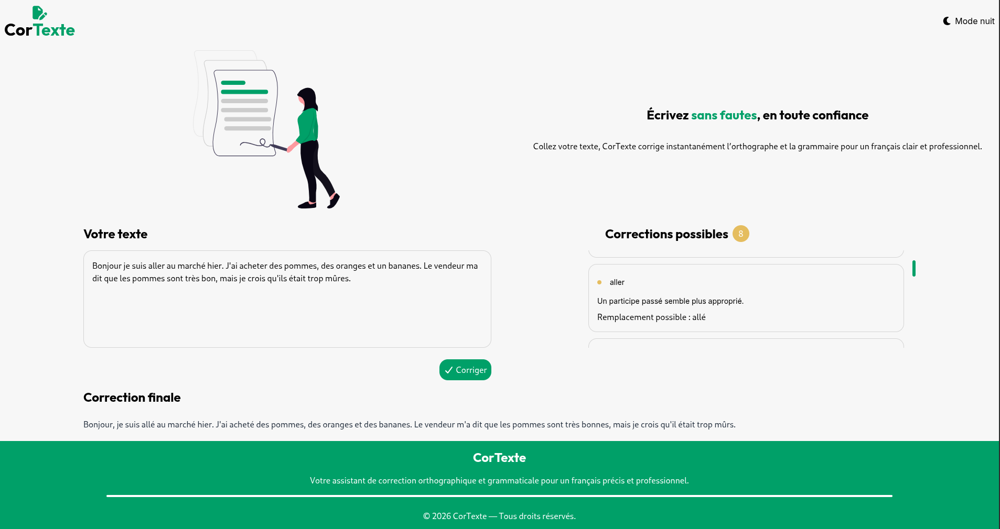

# CorText

  

CorText is a web application that allows users to correct French text.
The user can enter their text, click the button, and receive suggested corrections as well as the final corrected version.



# Application features

- [x] Input of a text in French.
- [x] Spelling and grammar error detection.
- [x] Displaying possible corrections.
- [x] Displaying the final corrected text.
- [ ] Dark / light mode

# Installation

Follow these steps to set up the project locally:

1. Clone the repository:

```bash
git clone https://github.com/nambinintsoaJoseph/CorTexte.git
cd cortexte
```

2. Install the dependencies:

```bash
npm install
```

3. Start the development server:

```bash
npm run dev
```

4. Open your browser and navigate to http://localhost:5173

Alternatively, you can use yarn or pnpm if you have them installed.

⚠️ Important Note
This React frontend requires a backend API for full functionality. The API is currently private.
